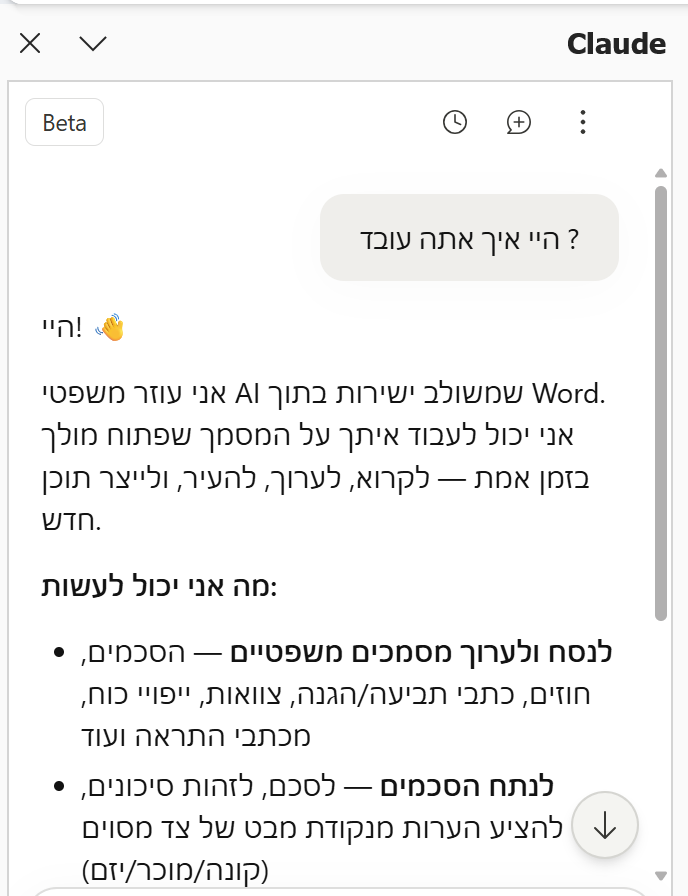
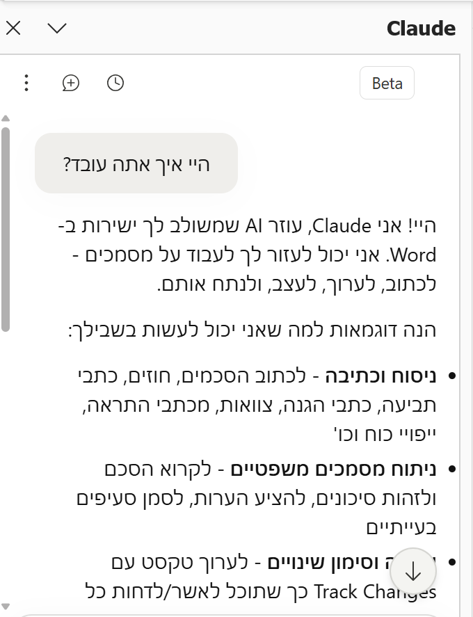
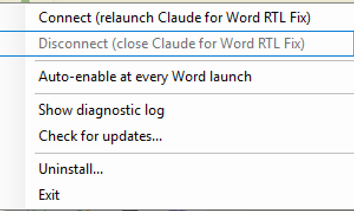
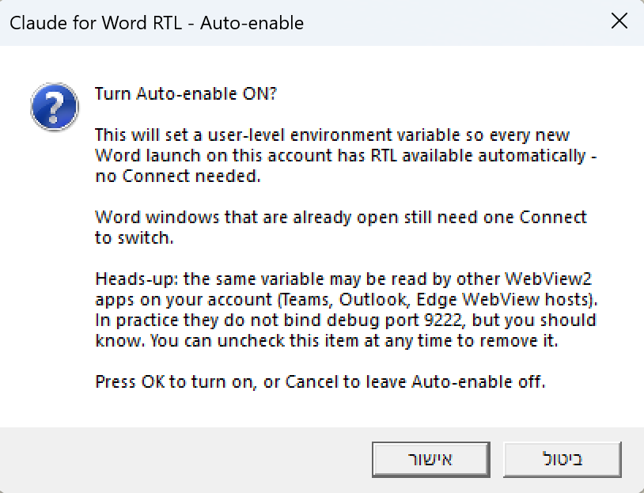
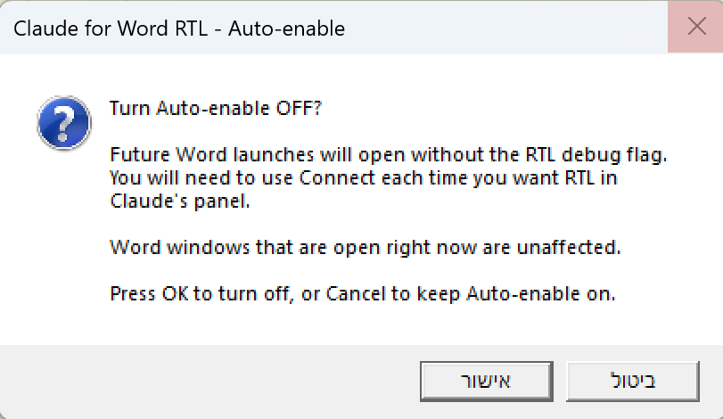
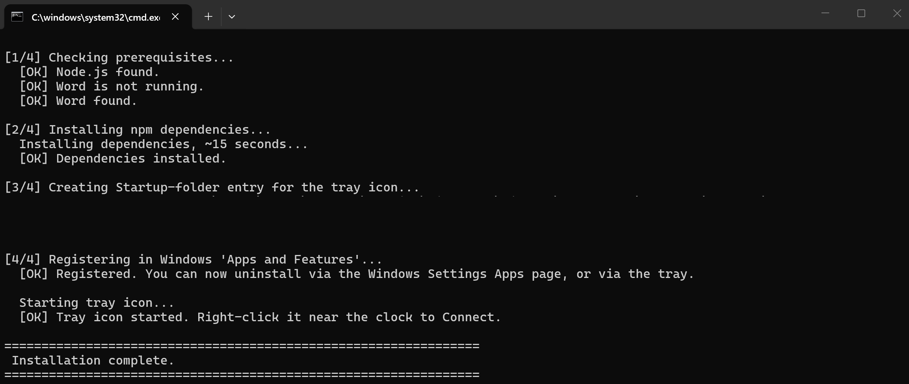
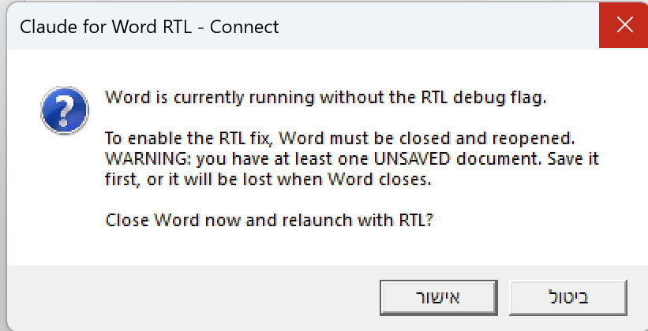

<h1>Claude for Word RTL Fix</h1>

תיקון RTL לפאנל של Claude ב-Microsoft Word. מקומי, בלי טלמטריה, Apache 2.0. 
<em>לכל מי שכותב עברית ב-Word עם תוסף Claude. Windows 10/11.</em>

<strong>אינו תוסף רשמי של Anthropic או של Microsoft.</strong> כלי open-source עצמאי.

  
  
  
  
  

<h2>מה זה עושה?</h2>

הפאנל של Claude בתוך Word לא תומך ב-RTL. עברית יוצאת הפוכה, bullets
בצד הלא נכון, פיסוק נופל איפה שלא צריך. הכלי מתחבר ל-WebView2 של
הפאנל דרך Chrome DevTools Protocol, מזריק CSS ו-MutationObserver, והפאנל
עובר ל-RTL תקין.

המודל של Claude, ה-API של Anthropic, ו-Word עצמו לא נגועים. רק ה-DOM
המקומי של הפאנל, ורק כל עוד הפאנל פתוח.

<h2>פיצ'רים</h2>

<h3>הפאנל עובר ל-RTL</h3>

כיוון טקסט, יישור, bullets, טבלאות. בלוקי קוד (<code>&lt;pre&gt;</code>, <code>&lt;code&gt;</code>)
נשארים LTR כך שקוד לא מתעוות.

  
  
   
  <em>משמאל - הפאנל לפני. מימין - אחרי RTL. אותה שאלה, אותה תשובה.</em>

<h3>התערבות מינימלית ב-Word</h3>

הכלי לא משנה file associations, לא נוגע ב-<code>Normal.dotm</code>, לא
מוסיף טמפלטים או תוספים, ולא יוצר services. ההתקנה כן יוצרת שני דברים
ברמת המשתמש: קיצור ב-Startup folder שמעלה את ה-tray בלוגין (ניתן
למחוק ידנית מ-<code>shell:startup</code>), ומפתח רישום תחת
<code>HKCU\Software\Microsoft\Windows\CurrentVersion\Uninstall\ClaudeWordRTL</code>
כדי שהכלי יופיע ב-Windows Settings &gt; Apps. שניהם נמחקים ע"י
<code>uninstall.bat</code>.

<h3>Tray icon ליד השעון</h3>

אייקון קטן ליד השעון: ריבוע מעוגל עם האות <strong>W</strong> וחץ RTL
לבנים, וצבע רקע שמשקף את המצב. אפור = בטעינה, אדום = מנותק, ירוק =
RTL פעיל. קליק ימני פותח תפריט קצר. אין כניסה ב-Start Menu, אין שינוי
של קיצורי מערכת.

  
  &nbsp;&nbsp;
  
   
  <em>מימין: אייקון אדום (מנותק או בהפעלה). משמאל: אייקון ירוק (מחובר, RTL פעיל בפאנל).
  צילומי מסך אמיתיים מה-tray של Windows.</em>

<table dir="rtl">
  <thead>
    <tr><th>פריט בתפריט</th><th>מתי זמין</th><th>מה עושה</th></tr>
  </thead>
  <tbody>
    <tr>
      <td>Connect (relaunch Claude for Word RTL Fix)</td>
      <td>האייקון אדום</td>
      <td>מעלה מחדש את Word דרך ה-wrapper עם debug-port פתוח. אם Word רץ - שומר מסמכים, מבקש אישור, מריץ מחדש עם אותם מסמכים</td>
    </tr>
    <tr>
      <td>Disconnect (close Claude for Word RTL Fix)</td>
      <td>תמיד</td>
      <td>כפתור התאוששות אוניברסלי. עוצר timers של Connect באוויר, סוגר את Word (graceful + force כגיבוי), הורג את ה-injector, מנקה את כל ה-state files. אם משהו השתבש - לחיצה כאן תמיד מחזירה למצב אפס</td>
    </tr>
    <tr>
      <td>Auto-enable at every Word launch (checkbox)</td>
      <td>תמיד</td>
      <td>מדליק RTL לכל פתיחה עתידית של Word בלי שתצטרכו ללחוץ Connect. ראו "שני מצבי עבודה" למטה</td>
    </tr>
    <tr>
      <td>Show diagnostic log</td>
      <td>תמיד</td>
      <td>פותח את <code>%TEMP%\claude-word-rtl.log</code> ב-editor של ברירת המחדל. שימושי כשמשהו לא עובד</td>
    </tr>
    <tr>
      <td>Check for updates...</td>
      <td>תמיד</td>
      <td>מפעיל את <code>check-update.js</code> ומציג דיאלוג עם הסטטוס. אם יש גרסה חדשה, כפתור בלחיצה אחת פותח את דף ההורדה בדפדפן</td>
    </tr>
    <tr>
      <td>Uninstall...</td>
      <td>תמיד</td>
      <td>מפעיל את <code>uninstall.bat</code> עם אישור</td>
    </tr>
    <tr>
      <td>Exit</td>
      <td>תמיד</td>
      <td>עוצר את האייקון</td>
    </tr>
  </tbody>
</table>

  

<h3>שני מצבי עבודה</h3>

<table dir="rtl">
  <thead>
    <tr><th>מצב</th><th>מה קורה</th><th>למי מתאים</th></tr>
  </thead>
  <tbody>
    <tr>
      <td>ידני (ברירת מחדל)</td>
      <td>כל פעם שפותחים את Word, האייקון אדום. לחיצה על <strong>Connect</strong> מריצה את Word מחדש דרך ה-wrapper. RTL פעיל רק כשבוחרים בכך</td>
      <td>למי שרוצה שליטה מלאה, או עובד לעיתים רחוקות עם Claude בעברית</td>
    </tr>
    <tr>
      <td>אוטומטי (Auto-enable)</td>
      <td>סימון ה-checkbox בתפריט מוסיף משתנה סביבה קבוע ל-user profile. מעכשיו <strong>כל</strong> פתיחה של Word מתחילה עם RTL מופעל. set-it-and-forget-it</td>
      <td>למי שעובד קבוע עם Claude בעברית ורוצה שהכל יעבוד אוטומטית</td>
    </tr>
  </tbody>
</table>

<strong>גילוי נאות על Auto-enable:</strong> המשתנה שנוסף הוא
<code>WEBVIEW2_ADDITIONAL_BROWSER_ARGUMENTS</code> ברמת <code>HKCU\Environment</code>.
WebView2 הוא רכיב משותף, ולכן המשתנה נקרא <em>גם</em> על ידי אפליקציות
WebView2 אחרות שפועלות תחת אותו user - כמו Teams, Outlook (new), וחלונות
Edge WebView אחרים. בפועל אף אחת מהן לא מאזינה ל-debug port על
<code>9222</code>, אבל המשתנה כן נקרא על ידן וזה משהו שנכון לדעת. אם
לא מקובל עליכם - השאירו את ה-Auto-enable כבוי והשתמשו ב-Connect ידני.
את ה-checkbox אפשר לכבות בכל רגע מהתפריט והמשתנה ינוקה.

ב-uninstall, ה-Auto-enable מנוקה אוטומטית - אבל רק אם הערך של המשתנה
תואם בדיוק לזה שלנו. ערך שמשתמש הוסיף ידנית לא נמחק.

  
  
   
  <em>שני כיווני ה-toggle - הפעלה (משמאל) וכיבוי (מימין). הטקסט מסביר בכל כיוון מה ישתנה.</em>

<h3>ניקוי טיפוגרפי</h3>

em-dash (—) ו-en-dash (–) מוחלפים ב-hyphen (-). חצים (→ ← ↔ ⇒ ⇐)
מוחלפים בפסיק. שדות קלט לא נוגעים בהם, כך שמה שאתה מקליד נשאר כמו שהוא.

<h3>Status שמשתדל לא להטעות</h3>

אם ה-injector מת בלי cleanup, ה-tray מזהה status מת ונהפך לאדום, כדי
להפחית מצבים שבהם האייקון ירוק בזמן שאין חיבור בפועל. ה-detection
מתבסס על בדיקת תהליך + חותמת זמן של קובץ הסטטוס, ולכן מתאושש גם
מקריסות קשות של ה-injector.

<h3>Uninstall שמנקה אחרי עצמו</h3>

<code>uninstall.bat</code> בארבעה שלבים: עוצר את ה-tray וה-injector, מסיר
את ה-Startup entry ואת המפתח ב-<code>HKCU\...\Uninstall\ClaudeWordRTL</code>,
מנקה את משתנה הסביבה של Auto-enable (אם הוא תואם לערך שלנו), ומפנק
את התלויות. המטרה: להסיר את כל מה שההתקנה יצרה. ערכים שהמשתמש הגדיר
ידנית באותו משתנה סביבה לא נמחקים.

<h2 id="install">התקנה</h2>

<strong>דרישות:</strong> Windows 10/11, Microsoft Word desktop עם תוסף Claude מותקן,
<a href="https://nodejs.org/">Node.js 16+</a>.

<ol>
  <li>להוריד זיפ מ-<a href="https://github.com/asaf-aizone/Claude-for-word-RTL-fix/releases">Releases</a>, או <code>git clone</code>.</li>
  <li>לחלץ לתיקייה שתישמר (למשל <code>C:\Tools\claude-word-rtl\</code>).</li>
  <li>לסגור את Word אם הוא פתוח.</li>
  <li>דאבל-קליק על <strong><code>install.bat</code></strong>.</li>
  <li>אייקון ה-tray יעלה ליד השעון, ויעלה אוטומטית גם בלוגין הבא.</li>
</ol>

לוגים נכתבים ל-<code>install.log</code> ליד ה-installer. לא נדרשות הרשאות admin.

  

<h3>הסרה</h3>

דאבל-קליק על <strong><code>uninstall.bat</code></strong>.

<h2>שימוש יום-יומי</h2>

אחרי התקנה, האייקון עולה אוטומטית בכל לוגין.

<strong>מצב ידני (ברירת מחדל):</strong>

<ol>
  <li>פותחים את Word איך שרגילים - Start Menu, דאבל-קליק על <code>.docx</code>, Recent files.</li>
  <li>אם האייקון <strong>אדום</strong> (ה-injector לא מחובר לפאנל): קליק ימני, <strong>Connect</strong>.</li>
  <li>דיאלוג יקפוץ עם הסבר על מה שיקרה. אם יש מסמכים לא שמורים - תופיע אזהרה מפורשת. אישור סוגר את Word ומריץ אותו מחדש עם אותם מסמכים.</li>
  <li>האייקון נהפך ל<strong>ירוק</strong>. הפאנל RTL.</li>
</ol>

  

<strong>מצב אוטומטי (Auto-enable מסומן):</strong>

<ol>
  <li>פותחים את Word איך שרגילים. זהו.</li>
  <li>האייקון בתפריט הופך לירוק תוך שניות, הפאנל כבר RTL.</li>
  <li>בפועל אין צורך לפתוח את התפריט - האייקון משמש כאינדיקטור סטטוס בלבד.</li>
</ol>

<h2>איך זה עובד?</h2>

<code>word-wrapper.bat</code> מריץ את Word עם משתנה סביבה
<code>WEBVIEW2_ADDITIONAL_BROWSER_ARGUMENTS=--remote-debugging-port=9222</code>.
זה flag רשמי של Microsoft שפותח Chrome DevTools Protocol ב-<code>localhost:9222</code>.
תהליך Node קטן (<code>scripts/inject.js</code>) מתחבר דרך WebSocket מקומי,
מאתר את ה-page שה-URL שלו תואם לפאנל של Claude, ומריץ <code>Runtime.evaluate</code>
כדי להזריק <code>&lt;style&gt;</code> ו-MutationObserver. לולאה של שתי שניות מזריקה מחדש
אם הפאנל טוען את עצמו.

ה-injector לא יוצר ולא שולח בקשות HTTP. הפאנל ממשיך לדבר ישירות מול
Anthropic כמו תמיד - ה-wrapper פשוט מוסיף flag ל-WebView2 ומחכה בצד.

ה-Connect לא תוקע את ה-UI: התפריט נסגר מיד, וה-state machine ממשיך ברקע
דרך timer. אם Word לא נסגר תוך 10 שניות, מופיע דיאלוג OK/Cancel - OK
מחסל את התהליך ומריץ מחדש, Cancel משאיר את Word כפי שהוא.

מודל האיומים המלא: <a href="docs/security.md"><code>docs/security.md</code></a>.

<h2>מה הכלי נוגע בו?</h2>

<table dir="rtl">
  <thead>
    <tr><th>משאב</th><th>גישה</th><th>למה</th></tr>
  </thead>
  <tbody>
    <tr>
      <td>WebView2 של Word</td>
      <td>קריאה דרך Chrome DevTools Protocol על <code>localhost:9222</code></td>
      <td>לאתר את הפאנל של Claude ולהזריק CSS</td>
    </tr>
    <tr>
      <td>משתנה סביבה <code>WEBVIEW2_ADDITIONAL_BROWSER_ARGUMENTS</code></td>
      <td>במצב ידני: כתיבה בהקשר ה-wrapper בלבד. במצב Auto-enable: כתיבה קבועה ב-<code>HKCU\Environment</code></td>
      <td>לפתוח את ה-debug port ב-WebView2 ברגע הפעלה של Word. במצב Auto-enable - לכל פתיחה עתידית</td>
    </tr>
    <tr>
      <td><code>%TEMP%</code></td>
      <td>כתיבה של PID ו-status של ה-injector</td>
      <td>למעקב אחר מצב ההזרקה מה-tray ומניעת mass-kill של תהליכי Node</td>
    </tr>
    <tr>
      <td>Startup folder של המשתמש</td>
      <td>יצירת קיצור אחד לכניסה</td>
      <td>להפעיל את ה-tray אוטומטית בלוגין</td>
    </tr>
    <tr>
      <td><code>HKCU\Software\Microsoft\Windows\CurrentVersion\Uninstall\ClaudeWordRTL</code></td>
      <td>כתיבה בהתקנה, מחיקה בהסרה</td>
      <td>רישום הכלי ב-Windows Settings &gt; Apps כדי שיופיע ברשימת Installed apps ויהיה ניתן להסרה משם</td>
    </tr>
    <tr>
      <td>Microsoft Word (COM)</td>
      <td>קריאה בלבד, רק בזמן Connect</td>
      <td>למנות מסמכים פתוחים כדי לפתוח אותם מחדש אחרי relaunch</td>
    </tr>
  </tbody>
</table>

<strong>בנוסף לטבלה למעלה, הכלי לא נוגע ב:</strong> file associations,
<code>Normal.dotm</code>, תוספים אחרים של Word, או services.
ב-registry הוא נוגע רק בשני המפתחות שבטבלה
(<code>HKCU\...\Uninstall\ClaudeWordRTL</code> תמיד,
ו-<code>HKCU\Environment</code> רק כש-Auto-enable פעיל).

<h2>Privacy</h2>

<ul>
  <li>בלי טלמטריה, אנליטיקס, או usage tracking.</li>
  <li>בלי חיבורי רשת יוצאים שהכלי יוזם.</li>
  <li>הכלי לא קורא את הפרומפטים שלך, את תשובות Claude, או את תוכן המסמכים. הקבצים היחידים שנכתבים לדיסק הם PID ו-status של ה-injector ב-<code>%TEMP%</code>, ולוגים אופציונליים של install ו-doctor.</li>
  <li>השיחה עם Claude עוברת ישירות בין WebView2 ל-Anthropic, בדיוק כמו בלי הכלי.</li>
</ul>

<h3>Security note</h3>

כל עוד Word רץ דרך הכלי, WebView2 פותח debug port ב-<code>localhost:9222</code>.
ה-port לא חשוף לרשת, אבל תהליך מקומי באותו user יכול להתחבר אליו (זה
המנגנון הסטנדרטי של Chrome DevTools Protocol; כל דפדפן מבוסס Chromium
שפותח debug port מתנהג אותו דבר). בפועל, כמעט כל מה שרץ בסשן שלך יכול
כבר לקרוא את הזיכרון של Word. השימוש ב-<strong>Disconnect</strong> מה-tray
כשסיימתם מנקה את ה-port. על מחשבים משותפים או לא מהימנים - אל תריצו.

דיווח על פגיעויות: <a href="SECURITY.md"><code>SECURITY.md</code></a>.

<h2>FAQ</h2>

<strong>האם Anthropic יחסמו אותי?</strong> 
לא צפוי. הכלי רק משנה איך הפאנל נראה ב-DOM המקומי שלך. מה שאתה שולח
ל-Claude ומה שהוא מחזיר לא משתנה, ו-rate limits ו-guardrails לא
נוגעים בהם. עם זאת, כמו בכל כלי צד-שלישי - תנאי השימוש של Anthropic
הם הקובעים, והאחריות על השימוש היא שלך.

<strong>מה הכלי עושה ל-Word?</strong> 
לא משנה את Word עצמו: בלי patch לתוסף, בלי שינוי טמפלטים, בלי
file associations. בהתקנה נוצרים קיצור בתיקיית Startup של המשתמש
ומפתח תחת <code>HKCU\...\Uninstall\ClaudeWordRTL</code> (כדי שהכלי יופיע
ב-Windows Settings &gt; Apps). שניהם מוסרים על ידי <code>uninstall.bat</code>,
וניתנים למחיקה ידנית גם כן.

<strong>למה אני צריך Node.js?</strong> 
ה-injector כתוב ב-Node כי הוא צריך לדבר עם CDP דרך WebSocket. בלי Node
האייקון יעלה אדום ויישאר אדום. אם אין לך Node מותקן, ההתקנה תסב תשומת
לבך לזה.

<strong>עדכון של תוסף Claude ישבור את זה?</strong> 
אפשר. ה-injector תלוי במבנה ה-DOM וב-URL pattern של הפאנל. אם Anthropic
ישנו משהו משמעותי, התיקון הוא בדרך כלל עדכון של סלקטור אחד. תפתחו issue
עם צילום מסך ונוציא patch.

<strong>Word Online? Mac? Microsoft 365 תאגידי עם EDR?</strong> 
Word Online - לא, הכלי דורש WebView2 של Word desktop. Mac - לא, Windows
בלבד. תאגידי - לבדוק עם IT לפני הפעלה של debug port ב-Office. לא
מיועד ל-laptops תאגידיים סגורים.

<strong>Word פתוח עם 10 מסמכים. Connect ייסגור אותם?</strong> 
כן, אבל בעדינות - Word מתבקש לשמור שינויים, מקבל את רשימת המסמכים דרך
COM, וה-wrapper פותח את כולם מחדש. אם משהו לא נשמר, Word ישאל כרגיל.

<strong>אין לי Git. אפשר בלי clone?</strong> 
כן. להוריד זיפ מ-Releases, לחלץ, להריץ <code>install.bat</code>.

<strong><code>check-update.bat</code> לא עובד.</strong> 
ידוע. עד ה-release הציבורי הראשון אין tag ב-repo וה-script יחזיר
<code>[ERROR]</code>. זה צפוי.

<h2>Troubleshooting</h2>

לפני הכל - לפתוח את <strong>Show diagnostic log</strong> מהתפריט. הלוג ב-
<code>%TEMP%\claude-word-rtl.log</code> נחתך בכל הפעלה ומציג: targets שנמצאו
ב-CDP, אירועי attach, שגיאות <code>listTargets</code>. ב-90% מהמקרים הסיבה
ברורה משם.

<table dir="rtl">
  <thead>
    <tr><th>סימפטום</th><th>מה לעשות</th></tr>
  </thead>
  <tbody>
    <tr>
      <td>האייקון לא עולה אחרי התקנה</td>
      <td>לבדוק שה-Startup entry נוצר: <code>Win+R</code>, <code>shell:startup</code>, לחפש את הקיצור</td>
    </tr>
    <tr>
      <td>האייקון נשאר אדום אחרי Connect</td>
      <td>פותחים <strong>Show diagnostic log</strong> מהתפריט. אם הלוג ריק או לא מובן - <code>doctor.bat</code> ולצרף ל-issue</td>
    </tr>
    <tr>
      <td>Connect לא סוגר את Word</td>
      <td>אחרי 10 שניות מופיע דיאלוג OK/Cancel. <strong>OK</strong> מחסל את התהליך ומריץ מחדש. <strong>Cancel</strong> משאיר את Word פתוח כדי לבדוק ידנית מה תוקע אותו</td>
    </tr>
    <tr>
      <td>תהליכי Node תקועים</td>
      <td><strong><code>cleanup.bat</code></strong> - מכוון לתהליכי Node שמריצים את <code>inject.js</code> של הכלי (זיהוי לפי command line), ולא לתהליכי Node אחרים שלא קשורים אליו</td>
    </tr>
    <tr>
      <td>האייקון אדום, Node לא מותקן</td>
      <td>לבדוק עם <code>node --version</code>. אם לא מותקן או מתחת ל-16, להוריד מ-<a href="https://nodejs.org/">nodejs.org</a></td>
    </tr>
    <tr>
      <td>הפאנל טוען והאייקון נשאר אדום</td>
      <td>ה-URL של הפאנל אולי השתנה. לפתוח issue עם צילום מסך של ה-URL ב-DevTools, ולצרף את <code>%TEMP%\claude-word-rtl.log</code></td>
    </tr>
    <tr>
      <td>Auto-enable לא לוקח אפקט באפליקציה אחרת (Teams/Outlook)</td>
      <td>צפוי. משתני סביבה נטענים בפתיחת תהליך. צריך לסגור ולפתוח מחדש את האפליקציה. שינוי משודר דרך <code>WM_SETTINGCHANGE</code> אבל לא משפיע על תהליכים שכבר רצים</td>
    </tr>
  </tbody>
</table>

<h2>Known limitations</h2>

<ul>
  <li>debug port ב-<code>localhost:9222</code> לא מאומת - כל תהליך מקומי באותו user יכול להתחבר. ראו "Security note".</li>
  <li>Microsoft 365 תאגידי עם EDR/DLP יכול לחסום את דגל ה-WebView2. הכלי לא מיועד ללפטופים ארגוניים סגורים.</li>
  <li>עדכון של תוסף Claude שמחליף את ה-DOM יכול לשבור את ההזרקה עד patch. יישלח release מתוקן.</li>
  <li>Word Online ו-Mac לא נתמכים.</li>
  <li>גרסאות של תוסף Claude שלא משתמשות ב-WebView2 (למשל Electron עצמאי) - לא נתמכות.</li>
</ul>

<h2>Contributing</h2>

Issues ו-PRs מתקבלים בברכה. לבאגים של תצוגה - selector שדלף, יישור שבור -
תפתחו issue עם:

<ul>
  <li>שחזור קצר: מה עשית, מה ציפית, מה קרה.</li>
  <li>צילום מסך של הפאנל.</li>
  <li>ה-<code>doctor.log</code> שלך.</li>
</ul>

<h2>Credits</h2>

<ul>
  <li>נוצר על ידי <strong>Asaf Abramzon</strong> - <a href="https://www.linkedin.com/in/asaf-abramzon-7a2b61180/">LinkedIn</a> · <a href="https://github.com/asaf-aizone">GitHub</a>.</li>
  <li><a href="https://github.com/cyrus-and/chrome-remote-interface"><code>chrome-remote-interface</code></a> - CDP client.</li>
</ul>

<h2>Disclaimer</h2>

כלי open-source עצמאי. לא מסונף ל-Anthropic או Microsoft, לא מאושר על ידן,
ולא מכיל קוד שלהן. "Claude" סימן מסחרי של Anthropic, PBC. "Microsoft"
ו-"Word" סימנים מסחריים של Microsoft Corporation.

<h2>מסמכים נוספים</h2>

<ul>
  <li><a href="CHANGELOG.md"><code>CHANGELOG.md</code></a> - יומן שינויים לכל גרסה.</li>
  <li><a href="README.he.md"><code>README.he.md</code></a> - גרסה עברית תמציתית (טקסט בלבד, ללא תמונות).</li>
  <li><a href="SECURITY.md"><code>SECURITY.md</code></a> - מדיניות דיווח פגיעויות.</li>
  <li><a href="docs/security.md"><code>docs/security.md</code></a> - מודל האיומים המלא.</li>
</ul>

<h2>License</h2>

Apache License 2.0, ראו <a href="LICENSE"><code>LICENSE</code></a>.

<strong>English version</strong>

<h1>Claude for Word RTL Fix</h1>

RTL fix for the Claude panel in Microsoft Word. Local-only, no telemetry, Apache 2.0.

<strong>Not an official Anthropic or Microsoft add-in.</strong> Independent open-source tool.

<h2>What it does</h2>

Anthropic's official Claude add-in for Word doesn't render Hebrew right-to-left.
Bullets land on the wrong side, alignment is reversed, punctuation ends up in
weird places. This tool attaches to the add-in's WebView2 panel via Chrome
DevTools Protocol, injects a small stylesheet plus a MutationObserver, and
flips the panel to correct RTL. The Claude model, the Anthropic API, and Word
itself are untouched - only the panel's local DOM, and only while the panel
is open.

<h2>Features</h2>

<ul>
  <li><strong>Instant RTL</strong> - direction, alignment, bullets, tables. <code>&lt;pre&gt;</code> and <code>&lt;code&gt;</code> stay LTR so source code isn't corrupted.</li>
  <li><strong>Tray-icon control</strong> - a small rounded-square icon near the clock: a white <strong>W</strong> and an RTL arrow on a status-colored background. Gray = starting. Red = not attached. Green = panel is RTL. Right-click for Connect / Disconnect / Auto-enable / Show diagnostic log / Check for updates / Uninstall / Exit. No Start Menu entry pretending to be Word. See the <a href="docs/images/tray-icon-red.png">red (disconnected)</a> and <a href="docs/images/tray-icon-green.png">green (connected)</a> states.</li>
  <li><strong>Two modes</strong> - Manual (click Connect each time) or Auto-enable (set-it-and-forget-it). See "Auto-enable" below for the trade-off.</li>
  <li><strong>Non-blocking Connect</strong> - the menu closes immediately, work proceeds on a background timer state machine. If Word doesn't close within 10 seconds, an OK/Cancel dialog offers force-kill or abort.</li>
  <li><strong>Minimal footprint</strong> - no file associations, no <code>Normal.dotm</code> changes, no templates, no services. Install creates two per-user items: a Startup-folder shortcut (so the tray auto-launches at login) and an <code>HKCU\...\Uninstall\ClaudeWordRTL</code> registry key (so the tool appears in Windows Settings &gt; Apps). Both are removed by <code>uninstall.bat</code>.</li>
  <li><strong>Hebrew typography cleanup</strong> - em-dash (—) and en-dash (–) become hyphen (-). Arrows (→ ← ↔ ⇒ ⇐) become commas. Input fields are left alone.</li>
  <li><strong>Crash-safe status</strong> - if the injector dies without cleanup, the tray detects stale state (process + status-file timestamp) and flips to red, to reduce cases where the icon shows green without an actual connection.</li>
  <li><strong>Diagnostic log</strong> - <code>%TEMP%\claude-word-rtl.log</code>, accessible from the tray menu. Truncated on each injector start. Shows discovered CDP targets, attach events, errors.</li>
  <li><strong>Clean uninstall</strong> - 4-step <code>uninstall.bat</code>: stop tray/injector, remove Startup entry + <code>HKCU\...\Uninstall\ClaudeWordRTL</code>, clear Auto-enable env var (only if it still matches our exact value - user-modified values are preserved), prune deps. Aims to remove everything the installer created.</li>
</ul>

<h3>Tray menu</h3>

<table>
  <thead>
    <tr><th>Item</th><th>When available</th><th>What it does</th></tr>
  </thead>
  <tbody>
    <tr><td>Connect (relaunch Claude for Word RTL Fix)</td><td>Icon is red</td><td>Relaunches Word through the wrapper with the debug-port enabled. If Word is already open, saves documents, asks for confirmation, and reopens them. Non-blocking - menu closes immediately.</td></tr>
    <tr><td>Disconnect (close Claude for Word RTL Fix)</td><td>Anytime</td><td>Universal recovery button. Stops any in-flight Connect timers, closes Word (graceful + force fallback), kills the injector, cleans up state files. If anything went wrong, clicking this always returns to a clean slate.</td></tr>
    <tr><td>Auto-enable at every Word launch (checkbox)</td><td>Anytime</td><td>Persists <code>WEBVIEW2_ADDITIONAL_BROWSER_ARGUMENTS</code> in <code>HKCU\Environment</code> so every future Word launch starts with RTL. See Auto-enable section for caveats.</td></tr>
    <tr><td>Show diagnostic log</td><td>Anytime</td><td>Opens <code>%TEMP%\claude-word-rtl.log</code> in the default editor.</td></tr>
    <tr><td>Check for updates...</td><td>Anytime</td><td>Runs <code>check-update.js</code> and shows the result in a dialog. When a newer release exists, a one-click button opens the download page in the default browser.</td></tr>
    <tr><td>Uninstall...</td><td>Anytime</td><td>Runs <code>uninstall.bat</code> after confirmation.</td></tr>
    <tr><td>Exit</td><td>Anytime</td><td>Stops the tray icon.</td></tr>
  </tbody>
</table>

<h3>Auto-enable: the trade-off</h3>

Auto-enable persists the WebView2 debug-port flag at user level. The
variable name is <code>WEBVIEW2_ADDITIONAL_BROWSER_ARGUMENTS</code>, and it's
read by every WebView2 host running under your user - Teams, the new
Outlook, Edge WebView windows, and any other WebView2-based app. In
practice most of them do not actually bind the debug port on
<code>9222</code>, but the variable is still read by them and that's worth
knowing. Uncheck the menu item at any time to remove it.

If that's not acceptable, leave Auto-enable off and use manual Connect.
On uninstall, the variable is cleared only if its value still matches
exactly what we wrote - any user-modified value is preserved.
  </tbody>
</table>

<h2 id="install-en">Install</h2>

<strong>Requirements:</strong> Windows 10/11, Microsoft Word desktop with Claude
add-in installed, <a href="https://nodejs.org/">Node.js 16+</a>.

<ol>
  <li>Download the zip from <a href="https://github.com/asaf-aizone/Claude-for-word-RTL-fix/releases">Releases</a> or <code>git clone</code>.</li>
  <li>Extract to a folder you'll keep (e.g. <code>C:\Tools\claude-word-rtl\</code>).</li>
  <li>Close Word if it's open.</li>
  <li>Double-click <strong><code>install.bat</code></strong>.</li>
  <li>Tray icon appears near the clock, and will launch automatically on every login.</li>
</ol>

Logs go to <code>install.log</code> next to the installer. No admin rights needed.

<h3>Uninstall</h3>

Double-click <strong><code>uninstall.bat</code></strong>.

<h2>Daily use</h2>

<ol>
  <li>Open Word the way you always do - Start Menu, double-click a <code>.docx</code>, Recent files.</li>
  <li>If the icon is <strong>red</strong>: right-click, <strong>Connect</strong>.</li>
  <li>The tool enumerates your open documents, asks for confirmation, reopens them.</li>
  <li>Icon turns <strong>green</strong>. Panel is RTL.</li>
</ol>

<h2>How it works</h2>

<code>word-wrapper.bat</code> launches Word with
<code>WEBVIEW2_ADDITIONAL_BROWSER_ARGUMENTS=--remote-debugging-port=9222</code>,
a Microsoft-documented flag that exposes Chrome DevTools Protocol on
<code>localhost:9222</code>. A small Node process (<code>scripts/inject.js</code>) connects
over the local WebSocket, finds the page whose URL matches the Claude panel,
and calls <code>Runtime.evaluate</code> to inject a <code>&lt;style&gt;</code> element and
a MutationObserver. A 2-second poll re-injects if the panel reloads.

All activity is local. The only outbound traffic is normal Claude-to-Anthropic
traffic, unchanged, routed by Word itself.

Full threat model: <a href="docs/security.md"><code>docs/security.md</code></a>.

<h2>What the tool accesses</h2>

<table>
  <thead>
    <tr><th>Resource</th><th>Access</th><th>Why</th></tr>
  </thead>
  <tbody>
    <tr>
      <td>Word's WebView2</td>
      <td>Read via Chrome DevTools Protocol on <code>localhost:9222</code></td>
      <td>Locate the Claude panel and inject CSS</td>
    </tr>
    <tr>
      <td><code>WEBVIEW2_ADDITIONAL_BROWSER_ARGUMENTS</code> env var</td>
      <td>Manual mode: written in the wrapper's context only. Auto-enable mode: persisted in <code>HKCU\Environment</code></td>
      <td>Open the debug port at Word launch (or for every future WebView2 host launch when Auto-enable is on)</td>
    </tr>
    <tr>
      <td><code>%TEMP%</code></td>
      <td>Writes injector PID and status</td>
      <td>Track injection state from the tray, prevent mass-kill of Node processes</td>
    </tr>
    <tr>
      <td>User Startup folder</td>
      <td>Creates one shortcut</td>
      <td>Launch the tray at login</td>
    </tr>
    <tr>
      <td><code>HKCU\Software\Microsoft\Windows\CurrentVersion\Uninstall\ClaudeWordRTL</code></td>
      <td>Written on install, removed on uninstall</td>
      <td>Register the tool in Windows Settings &gt; Apps &gt; Installed apps so it can be uninstalled from there</td>
    </tr>
    <tr>
      <td>Microsoft Word (COM)</td>
      <td>Read-only, only during Connect</td>
      <td>Enumerate open documents to reopen them after relaunch</td>
    </tr>
  </tbody>
</table>

<strong>Beyond the table above, the tool does not touch:</strong> file
associations, <code>Normal.dotm</code>, other Word add-ins, or Windows
services. The only registry keys it writes are the two in the table
(<code>HKCU\...\Uninstall\ClaudeWordRTL</code> always, and
<code>HKCU\Environment</code> only when Auto-enable is on).

<h2>Privacy</h2>

<ul>
  <li>No telemetry, analytics, or usage tracking.</li>
  <li>No outbound network connections initiated by this tool.</li>
  <li>No collection, storage, or logging of your prompts, Claude's responses, or document content. The only files written to disk are the injector's PID and status in <code>%TEMP%</code>, plus optional install/doctor logs.</li>
  <li>No third-party services. Conversations with Claude go directly between Word's WebView2 and Anthropic, exactly as without this tool.</li>
</ul>

<h3>Security note</h3>

While Word runs via this tool, WebView2 opens a debug port on
<code>localhost:9222</code>. Any local process on the same user can connect and
read the panel's DOM. The port is localhost-only, but unauthenticated.
Use <strong>Disconnect</strong> when done. Don't run on shared or untrusted machines.

<h2>FAQ</h2>

<strong>Will Anthropic block me?</strong> 
Not expected. The tool only changes how the panel renders in your local DOM.
It doesn't alter what you send, what Claude returns, rate limits, or
guardrails. That said, Anthropic's terms of service are what matter and
responsibility for usage is yours.

<strong>Does it modify Word?</strong> 
It doesn't modify Word itself: no template changes, no add-in patches, no
file-association changes. Install does create two per-user items: a
Startup-folder shortcut and an <code>HKCU\...\Uninstall\ClaudeWordRTL</code>
registry key (so the tool appears in Windows Settings &gt; Apps). Both are
removed by <code>uninstall.bat</code> and can also be cleaned up by hand.

<strong>Why do I need Node.js?</strong> 
The injector is written in Node because it needs to talk to CDP over
WebSocket. Without Node, the tray stays red.

<strong>Will a Claude add-in update break it?</strong> 
Possibly. The injector depends on the panel's DOM structure and URL pattern.
If Anthropic ships a significant change, the fix is usually a one-selector
update. Open an issue with a screenshot.

<strong>Word Online, Mac, corporate M365 with EDR?</strong> 
Word Online - no, requires Word desktop's WebView2. Mac - no, Windows only.
Corporate - check with your IT team before enabling a WebView2 debug port.
Not intended for sealed corporate laptops.

<strong>Word is open with 10 documents. Will Connect close them?</strong> 
Yes, gracefully. Word is asked to save changes, the document list is captured
via COM, and the wrapper reopens all of them. If something wasn't saved,
Word will prompt as usual.

<strong><code>check-update.bat</code> doesn't work.</strong> 
Known. Until the first public release is tagged, the script will report
<code>[ERROR]</code>. That's expected.

<h2>Troubleshooting</h2>

Always start with <strong>Show diagnostic log</strong> from the tray menu.
The log at <code>%TEMP%\claude-word-rtl.log</code> truncates on each injector
launch and shows discovered CDP targets, attach events, and <code>listTargets</code>
errors. 90% of issues are obvious from there.

<table>
  <thead>
    <tr><th>Symptom</th><th>What to do</th></tr>
  </thead>
  <tbody>
    <tr>
      <td>Icon doesn't appear after install</td>
      <td>Check the Startup entry was created: <code>Win+R</code>, <code>shell:startup</code></td>
    </tr>
    <tr>
      <td>Icon stays red after Connect</td>
      <td>Open <strong>Show diagnostic log</strong>. If unclear, run <code>doctor.bat</code> and attach to an issue</td>
    </tr>
    <tr>
      <td>Connect doesn't close Word</td>
      <td>After 10s a dialog appears: <strong>OK</strong> force-kills and relaunches, <strong>Cancel</strong> leaves Word alone</td>
    </tr>
    <tr>
      <td>Lingering Node processes</td>
      <td><strong><code>cleanup.bat</code></strong> - targets Node processes running this tool's <code>inject.js</code> (matched by command line). Unrelated Node processes are left alone.</td>
    </tr>
    <tr>
      <td>Icon red, Node not installed</td>
      <td>Check with <code>node --version</code>. If missing or below 16, install from <a href="https://nodejs.org/">nodejs.org</a></td>
    </tr>
    <tr>
      <td>Panel loads but icon stays red</td>
      <td>The panel URL may have changed. Open an issue with a screenshot of the URL from DevTools and the diagnostic log</td>
    </tr>
    <tr>
      <td>Auto-enable doesn't take effect in Teams/Outlook</td>
      <td>Expected. Env vars load at process start. Close and reopen the app. <code>WM_SETTINGCHANGE</code> is broadcast but doesn't affect already-running processes</td>
    </tr>
  </tbody>
</table>

<h2>Known limitations</h2>

<ul>
  <li>The <code>localhost:9222</code> debug port is unauthenticated. See Security note.</li>
  <li>Corporate M365 with EDR/DLP may block the WebView2 flag. Not intended for sealed corporate laptops.</li>
  <li>A Claude add-in update that changes the panel DOM can break injection until a patch is released.</li>
  <li>Word Online and Mac aren't supported.</li>
  <li>Custom builds of the Claude add-in (standalone Electron, alternate WebView) aren't supported.</li>
</ul>

<h2>Contributing</h2>

Issues and PRs welcome. For display bugs, open an issue with a short
repro (what you did, what you expected, what happened), a screenshot of
the panel, and your <code>doctor.log</code>.

<h2>Credits</h2>
<ul>
  <li>Created by <strong>Asaf Abramzon</strong> - <a href="https://www.linkedin.com/in/asaf-abramzon-7a2b61180/">LinkedIn</a> · <a href="https://github.com/asaf-aizone">GitHub</a>.</li>
  <li><a href="https://github.com/cyrus-and/chrome-remote-interface"><code>chrome-remote-interface</code></a> - CDP client.</li>
</ul>

<h2>Disclaimer</h2>

Independent open-source tool. Not affiliated with, endorsed by, or connected
to Anthropic or Microsoft. "Claude" is a trademark of Anthropic, PBC.
"Microsoft" and "Word" are trademarks of Microsoft Corporation. This project
does not redistribute, modify, or contain proprietary code from either company.

<h2>Further reading</h2>

<ul>
  <li><a href="CHANGELOG.md"><code>CHANGELOG.md</code></a> - changelog per release.</li>
  <li><a href="README.he.md"><code>README.he.md</code></a> - concise Hebrew-only version (text only, no images).</li>
  <li><a href="SECURITY.md"><code>SECURITY.md</code></a> - vulnerability reporting policy.</li>
  <li><a href="docs/security.md"><code>docs/security.md</code></a> - full threat model.</li>
</ul>

<h2>License</h2>

Apache License 2.0 - see <a href="LICENSE"><code>LICENSE</code></a>.

